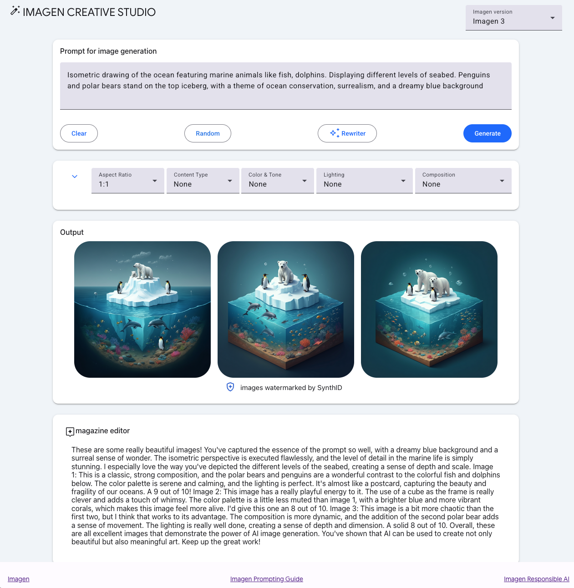

# GenMedia Creative Studio | Vertex AI

GenMedia Creative Studio is an app that highlights the capabilities of Google Cloud Vertex AI generative AI creative APIs, including Imagen, the text-to-image model.

Features Gemini for prompt rewriting as well as for a critic to provide a multimodal evaluation of the generated images.

This app is built with [Mesop](https://mesop-dev.github.io/mesop/), a Python-based UI framework that enables you to rapidly build web apps like this demo and internal apps.

### **New!** Experiments

We're releasing stand-alone applications in advance of integration into the main GenMedia Creative Studio. Please see the [experiments](/experiments/) folder for new, upcoming capbilities.

* **GenMedia Creative Studio - v.next** - [the next version](./experiments/veo-app/) of GenMedia Creative Studio
* **Creative GenMedia Workflow** - combining product image, brand guidelines and brief to create prompts for generation of creative video content using Veo.
* **MCP tools for Genmedia** - Model Context Protocol servers for genmedia services
* **Babel** - Chirp 3: HD Voices
* **Arena** - rate Model Garden image models
* **Creative Podcast Assistant** - create a podcast using Chirp 3, using audio and other sources
* **More!!**

## GenMedia | Creative Studio



## Run locally

### Prerequisites

#### 1. Environment Variables

Two environment variables are required to run this application:

`PROJECT_ID`
Provide an environment variable for your Google Cloud Project ID

```bash
export PROJECT_ID=$(gcloud config get project)
```

`IMAGE_CREATION_BUCKET`  
You'll need Google Cloud Storage bucket for the generative media. Note that this has to exist prior to running the application.

If an existing Google Cloud Storage bucket is available, please provide its name without the `"gs://"` prefix.  

```bash
export IMAGE_CREATION_BUCKET=$PROJECT_ID-genmedia
```  

Otherwise, follow the next steps to create a storage bucket.

#### 2. Service Account Setup for Local Development

For local development, you need a service account with proper permissions to generate signed URLs for private GCS buckets and access Vertex AI services.

**Check existing service accounts:**

```bash
gcloud iam service-accounts list --project=$PROJECT_ID
```

**If you need to create a new service account:**

```bash
# Create a new service account
gcloud iam service-accounts create creative-studio-sa \
    --display-name="Creative Studio Service Account" \
    --description="Service account for Creative Studio image generation app" \
    --project=$PROJECT_ID
```

**Grant required permissions to your service account:**

```bash
# Replace with your actual service account email
export SA_EMAIL=creative-studio@$PROJECT_ID.iam.gserviceaccount.com

# Grant Storage Admin role (for GCS bucket access and signed URLs)
gcloud projects add-iam-policy-binding $PROJECT_ID \
    --member="serviceAccount:$SA_EMAIL" \
    --role="roles/storage.admin"

# Grant Vertex AI User role (for Imagen API)
gcloud projects add-iam-policy-binding $PROJECT_ID \
    --member="serviceAccount:$SA_EMAIL" \
    --role="roles/aiplatform.user"
```

**Generate and download service account key:**

```bash
# Create and download the JSON key file
gcloud iam service-accounts keys create credentials.json \
    --iam-account=$SA_EMAIL \
    --project=$PROJECT_ID
```

**Set environment variable for local authentication:**

```bash
# Set the environment variable to use the service account
export GOOGLE_APPLICATION_CREDENTIALS="./credentials.json"
```

> **IMPORTANT:** The `credentials.json` file contains sensitive information. Make sure it's included in your `.gitignore` file and never commit it to version control.

### Create Storage Bucket (Optional)

Please run the following command to obtain new credentials.  

```bash
gcloud auth login  
```  

If you have already logged in with a different account, run:  

```bash
gcloud config set account $PROJECT_ID  
```  

Create the storage bucket.  

```bash
gcloud storage buckets create gs://$IMAGE_CREATION_BUCKET --location=US --default-storage-class=STANDARD
```

> **NOTE:** We have provided a `env_template` that you can use to in your development environment. Simply duplicate it, rename it to `.env` and replace `<YOUR_GCP_PROJECT_ID>` with your project ID.  

Then run `source .env` to add those variables into your environment.  

### Create Virtual Environment

Create and activate a virtual environment for your solution.

```bash
python3 -m venv venv 
source venv/bin/activate
```  

### Install requirements

Install the required Python libraries.

```bash
pip install -r requirements.txt
```

### Run with mesop

To run locally, use the `mesop` command and open the browser to the URL provided:

```bash
mesop main.py
```

> **NOTE:** The mesop application may request you to allow it to accept incoming network connections. Please accept to avoid limiting the application's behavior.  

## Deploy to Cloud Run

Deploy this application to a Cloud Run service.
It's recommended that you create a separate service account to deploy a Cloud Run Service.

### Prerequisites for Cloud Run Deployment

#### 1. Service Account Setup

Use your existing service account or create a new one for Cloud Run:

```bash
# If using existing service account
export SA_EMAIL=creative-studio@$PROJECT_ID.iam.gserviceaccount.com

# OR create a new service account for Cloud Run (Recommended)
export SA_NAME=sa-imagen-studio
gcloud iam service-accounts create $SA_NAME --description="genmedia creative studio" --display-name="$SA_NAME"
export SA_EMAIL=$SA_NAME@$PROJECT_ID.iam.gserviceaccount.com
```

#### 2. Grant Required Permissions

```bash
# Grant Vertex AI User role
gcloud projects add-iam-policy-binding $PROJECT_ID \
  --member="serviceAccount:$SA_EMAIL" \
  --role="roles/aiplatform.user"

# Grant Storage Admin role (for signed URLs)
gcloud projects add-iam-policy-binding $PROJECT_ID \
  --member="serviceAccount:$SA_EMAIL" \
  --role="roles/storage.admin"

```

### Deploy to Cloud Run

Deploy with the service account and environment variables:

```bash
gcloud run deploy creative-studio --source . \
  --allow-unauthenticated --region us-central1 \
  --service-account $SA_EMAIL \
  --update-env-vars=IMAGE_CREATION_BUCKET=$IMAGE_CREATION_BUCKET,PROJECT_ID=$PROJECT_ID \
  --memory=2Gi --cpu=2 --timeout=3600
```

> **Note:** The application will automatically use the attached service account for GCS signed URLs (no JSON key needed).

### Deployment Features

* ✅ **No JSON keys in containers** - Uses Workload Identity
* ✅ **Automatic credential management** - Google handles token refresh
* ✅ **Service account authentication** - Secure access to Vertex AI and GCS
* ✅ **Private bucket support** - Generates signed URLs for secure image access
* ✅ **Scalable** - Handles multiple concurrent users

# Disclaimer

This is not an officially supported Google product.
